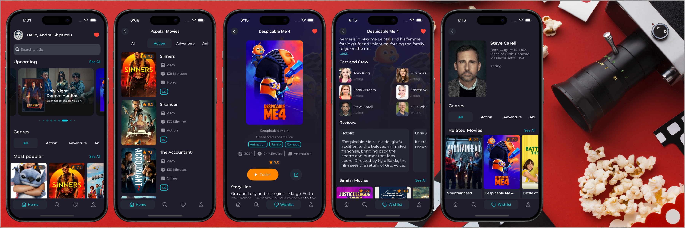
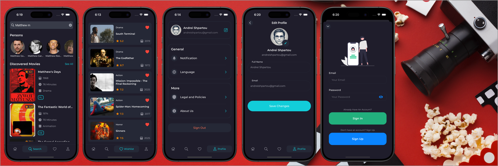

# MyMovies
           

A modern, customizable iOS movie app built with UIKit, following VIPER architecture, integrating Firebase Authentication, Firestore, CoreData, and Cloudinary.

This app allows users to browse movies, search for movies and persons, manage a wishlist, view details, securely sign up or log in, and edit profile information — while ensuring smooth and consistent data syncing through Firestore and CoreData local persistence.




## Table of Contents

- **[Features](#features)**
- **[Requirements](#requirements)**
- **[Installation](#installation)**
- **[Usage](#usage)**
- **[Architecture](#architecture)**
- **[Dependencies](#dependencies)**
- **[API](#api)**
- **[Contributing](#contributing)**
- **[License](#license)**
- **[Contact](#contact)**

## Features

- **Smart API Selection**: On launch, detects user location via ipify and ipinfo.io APIs to choose between TheMovieDB API and Kinopoisk API for region-optimized content.
- **Home Tab**: Browse categorized movie lists. Filter by genre, inspect full movie details, complete movie lists.
- **Search Tab**: Search movies and people. Keeps track of recently searched movies for quick access.
- **Wishlist Tab**: Manage your personal list of favorite movies, saved locally and synchronized.
- **Profile Tab**: Sign up / Sign in via Firebase Authentication. Profile editing with name and profile image (stored via Firestore and Cloudinary). Manage app settings.
- **Data Persistence**: Local movie details, genres, recently searched, and wishlist data caching via Core Data.
- **Performance Optimizations**: Image caching with Kingfisher. API response caching with a custom APICacheService.
- **Onboarding Animations**:  Beautiful Lottie animations on first launch.

## Requirements

- **Xcode**: 15.0.1 or newer (Recommended)
- **iOS**: 15.0+
- **Swift**: 5.0+

## Installation

1. Clone the repo:
    ```sh
    git clone https://github.com/AndreiShpartou/MyMovies.git
    ```

2. Navigate to the project directory:
    ```sh
    cd MyMovies
    ```
    
3. Install dependencies with CocoaPods:
    ```sh
    pod install
    ```
    
4. Open the project in Xcode:
    ```sh
    open MyMovies.xcworkspace
    ```

## Usage

Run the app on a simulator or physical device:
- Select the desired target device.
- Press `Cmd + R` to build and run the app.

## Architecture

The app is built using the **VIPER** architecture pattern to ensure a clean and scalable codebase.

## Dependencies

- Alamofire: Networking and API requests
- SnapKit: Auto Layout constraints
- Kingfisher: Image downloading & caching
- Lottie-ios: Onboarding animations
- Firebase (Auth, Firestore): Authentication and data storage
- Cloudinary: Cloud image management
- Core Data: Local movie and genre caching
- XCTest / XCUITest: Unit & UI testing


## API

- [ipify](https://www.ipify.org): Fetch public IP address
- [ipinfo](https://ipinfo.io): Get geolocation by IP
- [TheMovieDB](https://developer.themoviedb.org/docs/getting-started): Primary movie database
- [KinopoiskDB](https://api.kinopoisk.dev/documentation): Alternative movie database
- [Firebase Auth](https://firebase.google.com/products/auth): User authentication
- [Firebase Firestore](https://firebase.google.com/products/firestore): User data storage
- [Cloudinary](https://cloudinary.com): Profile image hosting


## Contributing

Contributions are welcome!
If you find any bugs or have suggestions for improvement, please create an issue or submit a pull request

## License
The data and images are used without claim of ownership and belong to their respective owners.
Distributed under the MIT License. See `LICENSE` for more information.

## Contact

[AndreiShpartou@gmail.com](mailto:AndreiShpartou@gmail.com)
